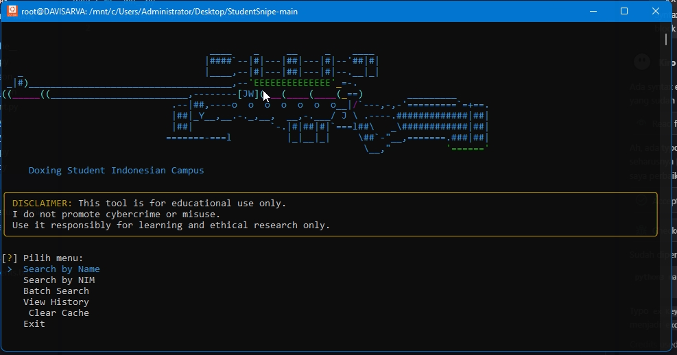
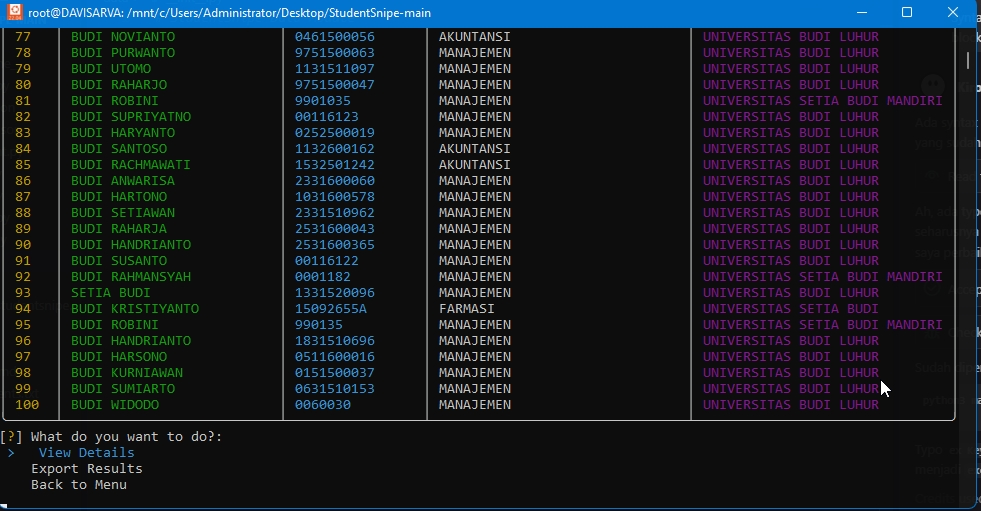

# 🎯 StudentSnipe — Terminal-based Student Info Collector


## 🛡️ Legal & Ethical Disclaimer

This tool is developed solely for **educational and research purposes**.  
All data processed and displayed is **publicly available** from the official PDDIKTI platform ([https://pddikti.kemdikbud.go.id](https://pddikti.kemdikbud.go.id)), and **no private or unauthorized information** is accessed.

> I do not encourage or support the use of this tool for cybercrime, illegal activities, or privacy violations.  
> This project is intended to be used responsibly for learning, academic exploration, and public data analysis.


## ✨ About This Project

**StudentSnipe** is a terminal-based tool designed to legally search and retrieve verified student data using the PDDIKTI library. Developed entirely in Python, it offers a clean, cross-platform, and beginner-friendly interface suitable for academic workflows, data validation, and efficient access to official student information.

Whether you’re a student, educator, or enthusiast, this tool can serve as a base for deeper educational software or automation ideas.

## ?? Screenshots

### Main Menu


### Search Results


## 🚀 Features

### Core Features
- 🔎 Search student data by **Full Name** or **NIM**
- 🎓 Displays comprehensive information:
  - Full Name
  - Student ID (NIM)
  - Program of Study
  - University
  - Enrollment Status
  - Angkatan (Year)
- 📟 Interactive and beautiful CLI interface with Rich library
- 💡 Open-source and modifiable
- 🧠 Ideal for academic analysis and ethical OSINT tasks

### Advanced Features
- 🔍 **Multiple Search Results**: View all matching students, not just the first
- 💾 **Smart Caching**: Faster searches with 24-hour cache
- 📜 **Search History**: Track your last 50 searches
- 💾 **Export Data**: Save results to JSON, CSV, or TXT
- 📦 **Batch Processing**: Search multiple students from a file
- 🎨 **Enhanced UI**: Beautiful tables, progress bars, and interactive menus
- ⚡ **Performance**: Optimized with caching and rate limiting

> 📖 For detailed feature documentation, see [FEATURES.md](FEATURES.md)


## 🚀 Quick Start

### 🔧 Requirements

- Python **3.6 or newer**
- `git` (if you want to clone)
- Internet access (for dependency installation)


## 📥 Cloning the Repository

### ✅ Windows

```bash
git clone https://github.com/davizofficial/StudentSnipe.git
cd StudentSnipe
````

### ✅ Linux / macOS

```bash
git clone https://github.com/davizofficial/StudentSnipe.git
cd StudentSnipe
```


## ⚙️ Running the App

### ▶️ On Windows

1. **Install Python:** [Download Python for Windows](https://www.python.org/downloads/windows/)
2. **Open Command Prompt** or PowerShell:

   ```bash
   cd path\to\StudentSnipe
   python -m venv venv
   venv\Scripts\activate
   pip install -r requirements.txt
   python main.py
   ```


### 🐧 On Linux

```bash
cd /path/to/StudentSnipe
python3 -m venv venv
source venv/bin/activate
pip3 install -r requirements.txt
python3 main.py
```


### 🍎 On macOS

```bash
cd /path/to/StudentSnipe
python3 -m venv venv
source venv/bin/activate
pip3 install -r requirements.txt
python3 main.py
```


## 🛠 Developer Tips

* Prefer terminals with color support (e.g., Windows Terminal, iTerm2)
* Use Python 3.6+ for f-string compatibility

## 🤝 Contributing

Pull requests are welcome!
Let’s improve this tool together. Fork it, build something cool, and submit a PR.


## 📫 Author

Created by **\[Daviz Arva]**
Feel free to connect via [GitHub Issues](https://github.com/davizofficial/StudentSnipe/issues)


 **This is not a scraping or illegal harvesting tool** — StudentSnipe mimics a user-facing search of publicly available records.
